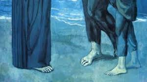

If all goes well, at the end of this session, which is nearly half over, I'd have understood how to include images in these articles. It might look like a mess, but if you're reading this, it means I've had great success with the [tutorials](https://www.gatsbyjs.com/docs/working-with-images-in-markdown/) on gatsby.com.

